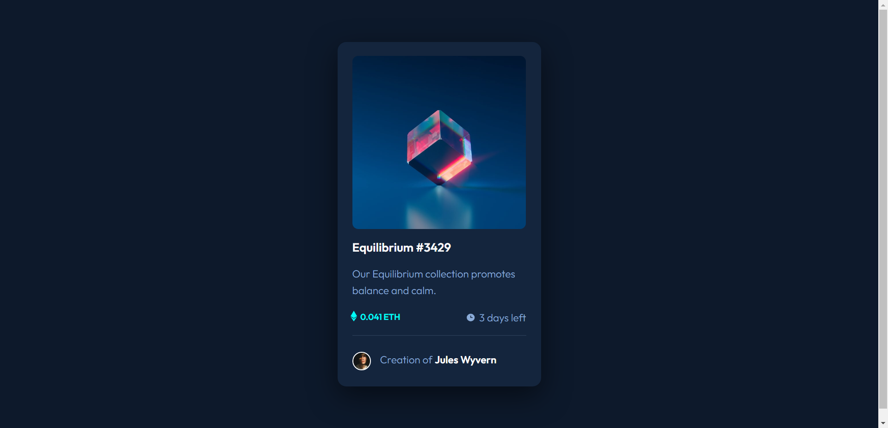
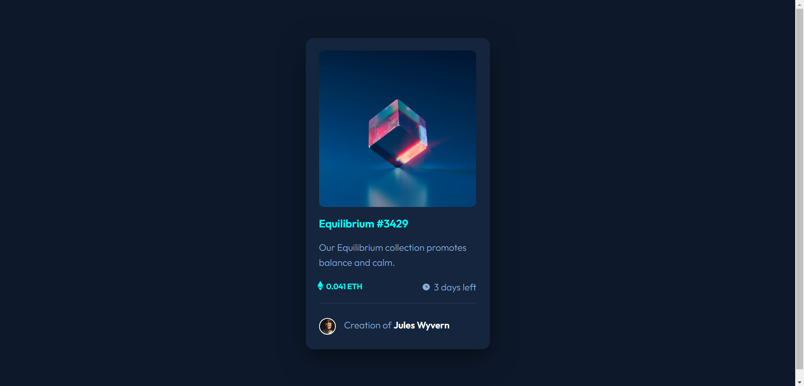
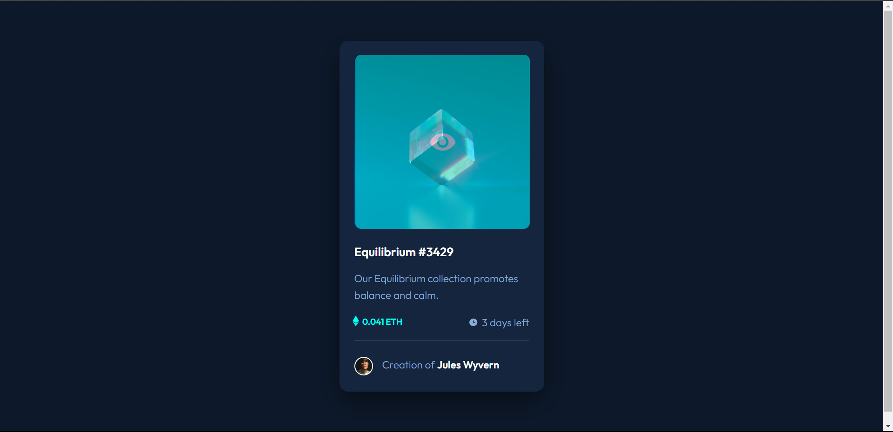
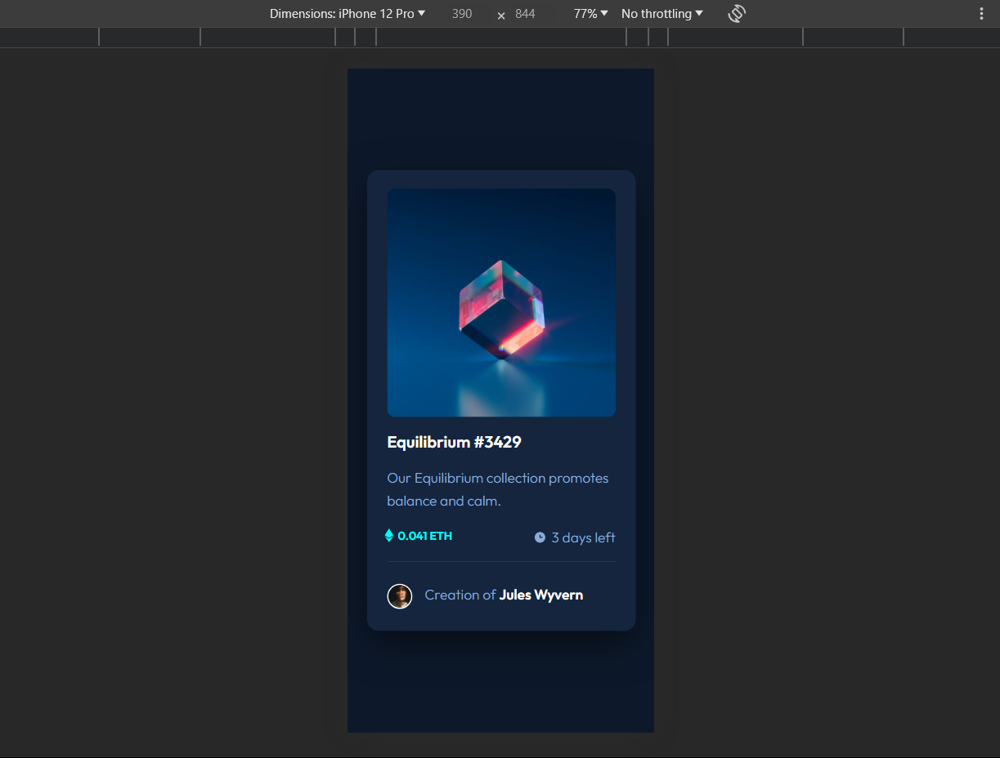

# Frontend Mentor - NFT preview card component solution

This is a solution to the [NFT preview card component challenge on Frontend Mentor](https://www.frontendmentor.io/challenges/nft-preview-card-component-SbdUL_w0U). Frontend Mentor challenges help you improve your coding skills by building realistic projects. 

## Table of contents

- [Overview](#overview)
  - [The challenge](#the-challenge)
  - [Screenshot](#screenshot)
  - [Links](#links)
- [My process](#my-process)
  - [Built with](#built-with)
  - [What I learned](#what-i-learned)
  - [Continued development](#continued-development)
  - [Useful resources](#useful-resources)
  - [Author](#author)

## Overview

- Front-End Mentor NFT preview card solution by Hassan Moataz.

### The challenge

Users should be able to:

- View the optimal layout depending on their device's screen size
- See hover states for interactive elements

### Screenshot

### Links

- Solution URL: (https://github.com/hassanmoaa/NFT-preview-card-FrontEndMentor.git)
- Live Site URL: (https://zingy-kitten-f5398f.netlify.app/)

### Built with

- Semantic HTML5 markup
- CSS custom properties
- Flexbox
- Google Fonts

### What I learned

I've had a hard time figuring out the suitable css properties for this challenge, also how to position the card correctly and how to position the overlay, using overlays and i learnt about rems started using it beside pixels and percentage.

Also using line-height, making a line using border-bottom or border-top.

It gived me motivation to pursue more Front-end challenges as it sharpens my skills while doing it!

- /*card-design*/
.card {
    background-color: var(--card-bg);
    width: min(87.5%, 22rem);
    margin: 9.5rem auto;
    border-radius: 15px;
    padding: 1.5rem 1.6rem 2rem;
    box-shadow: 0 1rem 3rem rgba(0, 0, 0, 0.5);
}

- /*overlay-eye-image*/
.overlay {
    position: absolute;
    top: 0;
    left: 0;
    right: 0;
    bottom: 0;
    height: 100%;
    width: 100%;
    opacity: 0;
    background-color: var(--cyan);    
}

### Continued development

- I want to learn more about css by creating multi-page websites

### Useful resources

-(https://www.w3schools.com) - W3S helped me with positioning and overlay position too.

## Author

- Frontend Mentor - [@hassanmoaa](https://www.frontendmentor.io/profile/hassanmoaa)
